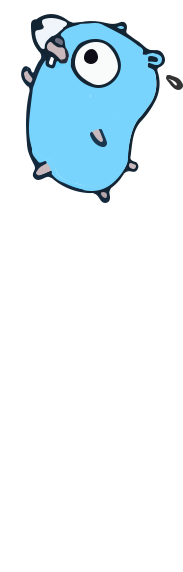

[](Nest.js)

## Full Stack & FullCycle - Fincycle - Backend de processamento das transações feito com Golang

## Descrição

Repositório do back-end de processamento das transações feito com Golang

**Importante**: A aplicação do Apache Kafka deve estar rodando primeiro.

## Rodar a aplicação

### Configurar /etc/hosts

A comunicação entre as aplicações se dá de forma direta através da rede da máquina.
Para isto é necessário configurar um endereços que todos os containers Docker consigam acessar.

Acrescente no seu /etc/hosts (para Windows o caminho é C:\Windows\system32\drivers\etc\hosts):

```
127.0.0.1 host.docker.internal
```

Em todos os sistemas operacionais é necessário abrir o programa para editar o *hosts* como Administrator da máquina ou root.

Execute os comandos:

```
docker-compose up
```

Use o Apache Kafka para produzir e consumir mensagens para testar a aplicação.
